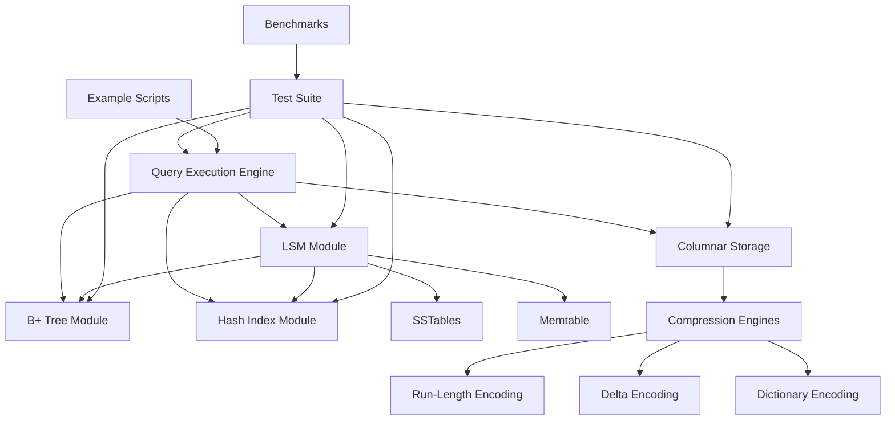

# Database Internals Repository Design

## Overview

The educational database internals repository will be implemented as a modular C++ system with Python bindings for ease of use and experimentation. The architecture follows a layered approach where higher-level components (Query Engine) depend on lower-level storage and indexing components. Each module is designed to be independently testable and educational, with clear interfaces and comprehensive documentation.

## Architecture



The system follows a bottom-up architecture:
- **Storage Layer**: B+ Tree, Hash Index, Columnar Storage
- **LSM Layer**: Memtable, SSTables, Compaction
- **Query Layer**: SQL-like query processing and optimization
- **Testing Layer**: Unit tests, integration tests, benchmarks

## Components and Interfaces

### B+ Tree Module

**Core Classes:**
- `BPlusTree<KeyType, ValueType>`: Main tree implementation
- `BPlusTreeNode`: Abstract base for internal and leaf nodes
- `InternalNode`: Non-leaf nodes containing keys and child pointers
- `LeafNode`: Leaf nodes containing key-value pairs and next pointers

**Key Interfaces:**
```cpp
template<typename KeyType, typename ValueType>
class BPlusTree {
public:
    bool insert(const KeyType& key, const ValueType& value);
    bool remove(const KeyType& key);
    std::optional<ValueType> search(const KeyType& key);
    std::vector<std::pair<KeyType, ValueType>> range_query(
        const KeyType& start, const KeyType& end);
    void print_tree() const; // For educational visualization
};
```

**Design Decisions:**
- Template-based for type flexibility
- Configurable branching factor (default 64 for cache efficiency)
- Leaf nodes maintain doubly-linked list for range queries
- Copy-on-write semantics for thread safety in reads

### Hash Index Module

**Core Classes:**
- `HashIndex<KeyType, ValueType>`: Main hash table implementation
- `HashBucket`: Bucket for collision handling
- `HashFunction`: Pluggable hash function interface

**Key Interfaces:**
```cpp
template<typename KeyType, typename ValueType>
class HashIndex {
public:
    bool insert(const KeyType& key, const ValueType& value);
    bool remove(const KeyType& key);
    std::optional<ValueType> lookup(const KeyType& key);
    void resize(size_t new_capacity);
    double load_factor() const;
};
```

**Design Decisions:**
- Open addressing with linear probing for cache locality
- Dynamic resizing when load factor exceeds 0.75
- Optional persistent storage using memory-mapped files
- Support for custom hash functions

### Columnar Storage Module

**Core Classes:**
- `ColumnStore`: Main columnar storage engine
- `Column<T>`: Type-specific column implementation
- `CompressionEngine`: Abstract base for compression algorithms
- `RLECompressor`, `DeltaCompressor`, `DictionaryCompressor`: Specific compression implementations

**Key Interfaces:**
```cpp
class ColumnStore {
public:
    void add_column(const std::string& name, ColumnType type);
    void insert_batch(const std::vector<Row>& rows);
    std::vector<Row> select_batch(const std::vector<size_t>& row_ids);
    std::vector<Row> scan_range(size_t start_row, size_t end_row);
    void compress_column(const std::string& column_name, CompressionType type);
};
```

**Design Decisions:**
- Separate storage for each column to optimize analytical queries
- Pluggable compression algorithms with automatic selection based on data patterns
- Vectorized operations using SIMD instructions where possible
- Batch-oriented API for high throughput

### LSM Module

**Core Classes:**
- `LSMTree`: Main LSM tree coordinator
- `Memtable`: In-memory sorted structure (using B+ tree internally)
- `SSTable`: Immutable sorted disk structure
- `CompactionManager`: Background compaction orchestrator

**Key Interfaces:**
```cpp
class LSMTree {
public:
    bool put(const std::string& key, const std::string& value);
    std::optional<std::string> get(const std::string& key);
    bool remove(const std::string& key);
    void flush_memtable();
    void compact_sstables();
    std::vector<std::pair<std::string, std::string>> range_scan(
        const std::string& start, const std::string& end);
};
```

**Design Decisions:**
- Size-tiered compaction strategy for simplicity
- Write-ahead log for durability
- Bloom filters in SSTables for efficient negative lookups
- Integration points for B+ tree and hash indexes

### Query Execution Engine

**Core Classes:**
- `QueryParser`: SQL-like query parsing
- `QueryPlanner`: Query optimization and plan generation
- `QueryExecutor`: Plan execution with vectorized operations
- `IndexManager`: Coordination between different index types

**Key Interfaces:**
```cpp
class QueryEngine {
public:
    QueryResult execute_query(const std::string& sql);
    void register_table(const std::string& name, std::shared_ptr<ColumnStore> store);
    void create_index(const std::string& table, const std::string& column, IndexType type);
    QueryPlan explain_query(const std::string& sql);
};
```

**Design Decisions:**
- Simple recursive descent parser for educational clarity
- Cost-based optimization with basic statistics
- Volcano-style iterator model with vectorized execution
- Support for index selection based on query patterns

## Data Models

### Storage Format

**Row Format (for mixed workloads):**
```cpp
struct Row {
    std::unordered_map<std::string, Value> columns;
    uint64_t timestamp;
    bool deleted;
};

struct Value {
    enum Type { INT, FLOAT, STRING, NULL_VALUE };
    Type type;
    union {
        int64_t int_val;
        double float_val;
        std::string* string_val;
    };
};
```

**Column Format (for analytical workloads):**
```cpp
template<typename T>
class Column {
    std::vector<T> data;
    std::unique_ptr<CompressionEngine> compressor;
    std::vector<bool> null_bitmap;
    ColumnStatistics stats;
};
```

### Index Structures

**B+ Tree Node Layout:**
```cpp
struct BPlusTreeNode {
    bool is_leaf;
    size_t key_count;
    std::vector<KeyType> keys;
    // Internal nodes: child pointers
    // Leaf nodes: values + next pointer
};
```

**SSTable Format:**
```cpp
struct SSTableHeader {
    uint32_t version;
    uint64_t num_entries;
    uint64_t index_offset;
    uint64_t bloom_filter_offset;
};
```

## Error Handling

### Error Categories

1. **Storage Errors**: Disk I/O failures, corruption detection
2. **Memory Errors**: Out of memory, allocation failures
3. **Logic Errors**: Invalid operations, constraint violations
4. **Query Errors**: Parse errors, type mismatches, missing tables

### Error Handling Strategy

```cpp
enum class DatabaseError {
    SUCCESS,
    KEY_NOT_FOUND,
    DUPLICATE_KEY,
    STORAGE_ERROR,
    MEMORY_ERROR,
    PARSE_ERROR,
    TYPE_ERROR
};

template<typename T>
class Result {
    DatabaseError error;
    std::optional<T> value;
    std::string error_message;
public:
    bool is_success() const;
    T unwrap() const;
    DatabaseError get_error() const;
};
```

**Design Principles:**
- No exceptions in core data structures for predictable performance
- Result types for explicit error handling
- Comprehensive logging for debugging
- Graceful degradation where possible

## Testing Strategy

### Unit Testing Framework

**Test Organization:**
```
tests/
├── unit/
│   ├── btree_test.cpp
│   ├── hash_index_test.cpp
│   ├── columnar_storage_test.cpp
│   ├── lsm_test.cpp
│   └── query_engine_test.cpp
├── integration/
│   ├── end_to_end_test.cpp
│   └── performance_test.cpp
└── benchmarks/
    ├── scan_vs_index_bench.cpp
    ├── compression_bench.cpp
    └── query_performance_bench.cpp
```

**Testing Approach:**
- Google Test framework for C++ unit tests
- Property-based testing for data structure invariants
- Stress testing with large datasets
- Performance regression testing
- Memory leak detection with Valgrind

### Benchmark Suite

**Key Benchmarks:**
1. **Point Lookup Performance**: Hash index vs B+ tree vs LSM tree
2. **Range Query Performance**: B+ tree vs full scan
3. **Compression Ratios**: Different algorithms on various data types
4. **Write Throughput**: LSM tree vs direct B+ tree writes
5. **Query Performance**: Index usage vs table scans

**Benchmark Infrastructure:**
- Configurable dataset sizes and distributions
- Multiple runs with statistical analysis
- Performance visualization with Python scripts
- Automated performance regression detection

### Educational Examples

**Example Scripts:**
1. `btree_demo.py`: Interactive B+ tree visualization
2. `compression_comparison.py`: Compare compression algorithms
3. `lsm_compaction_demo.py`: Visualize LSM compaction process
4. `query_optimization_demo.py`: Show query plan differences
5. `performance_analysis.py`: Analyze benchmark results

Each example includes:
- Step-by-step explanations
- Visualization of internal data structures
- Performance measurements
- Comparison with theoretical expectations

## Implementation Phases

The implementation will follow these phases to ensure educational value:

1. **Phase 1**: Core data structures (B+ tree, Hash index)
2. **Phase 2**: Storage layer (Columnar storage, compression)
3. **Phase 3**: LSM tree implementation
4. **Phase 4**: Query engine and optimization
5. **Phase 5**: Integration, testing, and documentation
6. **Phase 6**: Python bindings and educational examples

This phased approach allows students to understand each component independently before seeing how they integrate into a complete system.